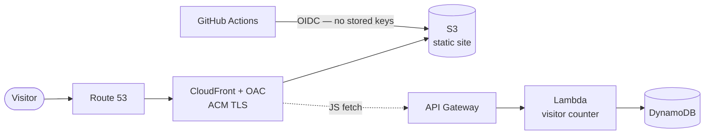

```mermaid
flowchart LR
    User([Visitor]) --> R53["Route 53"]
    R53 --> CF["CloudFront + OAC<br/>ACM TLS"]
    CF --> S3[("S3<br/>static site")]

    CF -.->|"JS fetch"| APIGW["API Gateway"]
    APIGW --> Lambda["Lambda<br/>visitor counter"]
    Lambda --> DDB[("DynamoDB")]

    GHA["GitHub Actions"] -->|"OIDC — no stored keys"| S3
```

“Serverless AWS resume site — Terraform, CI/CD, remote state, custom domain”
